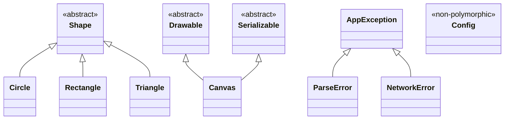

🔝 Back to [Table of Contents](/TABLE-OF-CONTENTS.md)

# Solution — Chapter 17 Checkpoint

# Reconstruct the classes of the `ch17-oop` binary from disassembly alone

> **SPOILERS** — This file contains the complete solution. Attempt the checkpoint before consulting it.

---

## Table of Contents

1. [Phase A — Initial Reconnaissance](#phase-a--initial-reconnaissance)  
2. [Phase B — Hierarchy Reconstruction via RTTI](#phase-b--hierarchy-reconstruction-via-rtti)  
3. [Phase C — Vtable Analysis](#phase-c--vtable-analysis)  
4. [Phase D — Object Memory Layouts](#phase-d--object-memory-layouts)  
5. [Phase E — Method Prototypes](#phase-e--method-prototypes)  
6. [Phase F — C++ Mechanism Identification](#phase-f--c-mechanism-identification)  
7. [Pass 2 — Reconstruction from the Stripped Binary](#pass-2--reconstruction-from-the-stripped-binary)

---

## Phase A — Initial Reconnaissance

### Binary Triage (`ch17-oop_O0`)

```bash
$ file ch17-oop_O0
ch17-oop_O0: ELF 64-bit LSB executable, x86-64, version 1 (SYSV),
             dynamically linked, interpreter /lib64/ld-linux-x86-64.so.2,
             for GNU/Linux 3.2.0, with debug info, not stripped

$ checksec --file=ch17-oop_O0
    Arch:     amd64-64-little
    RELRO:    Partial RELRO
    Stack:    Canary found
    NX:       NX enabled
    PIE:      No PIE (0x400000)
    RPATH:    No RPATH
    RUNPATH:  No RUNPATH
```

64-bit ELF binary, dynamically linked, **not stripped with debug info** (pass 1). ASLR disabled (no PIE), canary enabled.

### Class Name Extraction

```bash
$ strings ch17-oop_O0 | grep -oP '^\d+[A-Z]\w+' | sort -u
5Shape
6Canvas
6Circle
6Config
8Drawable
8Triangle
9Rectangle
10ParseError
12AppException
12NetworkError
12Serializable
```

**11 classes identified** via typeinfo name strings. Note that `Config` appears in the strings but doesn't necessarily have a vtable (to verify — if it's not polymorphic, it won't have typeinfo via RTTI but may appear through other mechanisms like exceptions).

### Symbol Volume

```bash
$ nm ch17-oop_O0 | wc -l
1847

$ nm ch17-oop_O0 | grep ' W ' | wc -l
1203

$ nm ch17-oop_O0 | grep ' T ' | wc -l
312

$ nm -C ch17-oop_O0 | grep 'vtable for' | wc -l
12
```

65% weak symbols (template instantiations). 12 vtables present.

---

## Phase B — Hierarchy Reconstruction via RTTI

### Typeinfo Classification

```bash
$ nm -C ch17-oop_O0 | grep 'typeinfo for' | grep -v 'typeinfo name'
```

By examining each `_ZTI` structure in `.rodata`, we identify the type by the typeinfo structure's vptr:

| Class | Typeinfo type | Justification |  
|-------|--------------|---------------|  
| `Shape` | `__class_type_info` | Root, no polymorphic parent |  
| `Circle` | `__si_class_type_info` | Inherits from Shape only |  
| `Rectangle` | `__si_class_type_info` | Inherits from Shape only |  
| `Triangle` | `__si_class_type_info` | Inherits from Shape only |  
| `Drawable` | `__class_type_info` | Root of its own hierarchy |  
| `Serializable` | `__class_type_info` | Root of its own hierarchy |  
| `Canvas` | `__vmi_class_type_info` | Inherits from Drawable AND Serializable (multiple) |  
| `AppException` | `__si_class_type_info` | Inherits from std::exception |  
| `ParseError` | `__si_class_type_info` | Inherits from AppException |  
| `NetworkError` | `__si_class_type_info` | Inherits from AppException |

`Config` has **no** polymorphic typeinfo — it has no virtual method, so no vtable, no vptr, no RTTI. It appears in `strings` only if its name is used in code (e.g. a string literal or via another mechanism). In reality, in our binary, `Config` is not polymorphic.

### Inheritance Links (`__base_type` pointers)

| Derived class | `__base_type` points to | Relationship |  
|---------------|-------------------------|-------------|  
| `Circle` | `_ZTI5Shape` | Circle → Shape |  
| `Rectangle` | `_ZTI5Shape` | Rectangle → Shape |  
| `Triangle` | `_ZTI5Shape` | Triangle → Shape |  
| `AppException` | `_ZTISt9exception` | AppException → std::exception |  
| `ParseError` | `_ZTI12AppException` | ParseError → AppException |  
| `NetworkError` | `_ZTI12AppException` | NetworkError → AppException |

For `Canvas` (`__vmi_class_type_info`), reading the `__base_info` array:

| Base | `__base_type` | `__offset_flags` | Offset | Public | Virtual |  
|------|---------------|-------------------|--------|--------|---------|  
| #0 | `_ZTI8Drawable` | `0x0000000000000002` | 0 | yes | no |  
| #1 | `_ZTI12Serializable` | `0x0000000000000802` | 8 | yes | no |

`__flags` = 0 (no diamond, no repetition).

### Reconstructed Hierarchy Diagram

```
std::exception
    +-- AppException (concrete)
            +-- ParseError (concrete)
            +-- NetworkError (concrete)

Shape (abstract — area() and perimeter() are pure)
    +-- Circle (concrete)
    +-- Rectangle (concrete)
    +-- Triangle (concrete)

Drawable (abstract — draw() is pure)
                                          \
                                            Canvas (concrete, multiple inheritance)
                                          /
Serializable (abstract — serialize() and deserialize() are pure)
```

In Mermaid notation:



---

## Phase C — Vtable Analysis

### `Shape` Vtable (abstract root class)

```bash
$ nm -C ch17-oop_O0 | grep 'vtable for Shape'
```

```
vtable for Shape @ _ZTV5Shape :
  [-16] offset-to-top  = 0
  [-8]  typeinfo        -> _ZTI5Shape
  [0]   slot 0 : Shape::~Shape() [D1]            — complete destructor
  [8]   slot 1 : Shape::~Shape() [D0]            — deleting destructor
  [16]  slot 2 : __cxa_pure_virtual               — area() = 0 (PURE)
  [24]  slot 3 : __cxa_pure_virtual               — perimeter() = 0 (PURE)
  [32]  slot 4 : Shape::describe() const          — default implementation
```

Slots 2 and 3 point to `__cxa_pure_virtual` → **Shape is abstract**.

### `Circle` Vtable

```
vtable for Circle @ _ZTV6Circle :
  [-16] offset-to-top  = 0
  [-8]  typeinfo        -> _ZTI6Circle
  [0]   slot 0 : Circle::~Circle() [D1]          — override
  [8]   slot 1 : Circle::~Circle() [D0]          — override
  [16]  slot 2 : Circle::area() const             — override (replaces pure virtual)
  [24]  slot 3 : Circle::perimeter() const        — override (replaces pure virtual)
  [32]  slot 4 : Circle::describe() const         — override
```

All slots are overridden. Same structure (5 slots) as Shape.

### `Rectangle` Vtable

```
vtable for Rectangle @ _ZTV9Rectangle :
  [-16] offset-to-top  = 0
  [-8]  typeinfo        -> _ZTI9Rectangle
  [0]   slot 0 : Rectangle::~Rectangle() [D1]    — override
  [8]   slot 1 : Rectangle::~Rectangle() [D0]    — override
  [16]  slot 2 : Rectangle::area() const          — override
  [24]  slot 3 : Rectangle::perimeter() const     — override
  [32]  slot 4 : Rectangle::describe() const      — override
```

### `Triangle` Vtable

```
vtable for Triangle @ _ZTV8Triangle :
  [-16] offset-to-top  = 0
  [-8]  typeinfo        -> _ZTI8Triangle
  [0]   slot 0 : Triangle::~Triangle() [D1]      — override
  [8]   slot 1 : Triangle::~Triangle() [D0]      — override
  [16]  slot 2 : Triangle::area() const           — override
  [24]  slot 3 : Triangle::perimeter() const      — override
  [32]  slot 4 : Shape::describe() const          — INHERITED (no override)
```

Slot 4 points to `Shape::describe()`, **not** to a `Triangle::` version. This indicates that `Triangle` does not override `describe()`.

### `Drawable` Vtable (abstract)

```
vtable for Drawable @ _ZTV8Drawable :
  [-16] offset-to-top  = 0
  [-8]  typeinfo        -> _ZTI8Drawable
  [0]   slot 0 : Drawable::~Drawable() [D1]
  [8]   slot 1 : Drawable::~Drawable() [D0]
  [16]  slot 2 : __cxa_pure_virtual               — draw() = 0 (PURE)
  [24]  slot 3 : Drawable::zOrder() const         — default implementation
```

### `Serializable` Vtable (abstract)

```
vtable for Serializable @ _ZTV12Serializable :
  [-16] offset-to-top  = 0
  [-8]  typeinfo        -> _ZTI12Serializable
  [0]   slot 0 : Serializable::~Serializable() [D1]
  [8]   slot 1 : Serializable::~Serializable() [D0]
  [16]  slot 2 : __cxa_pure_virtual               — serialize() = 0 (PURE)
  [24]  slot 3 : __cxa_pure_virtual               — deserialize() = 0 (PURE)
```

### `Canvas` Composite Vtable (multiple inheritance)

This is the most complex vtable. It consists of two parts:

```
vtable for Canvas @ _ZTV6Canvas :

  === Part 1: Drawable interface + Canvas own methods ===
  [-16] offset-to-top  = 0
  [-8]  typeinfo        -> _ZTI6Canvas
  [0]   slot 0 : Canvas::~Canvas() [D1]
  [8]   slot 1 : Canvas::~Canvas() [D0]
  [16]  slot 2 : Canvas::draw() const             — override of Drawable::draw
  [24]  slot 3 : Canvas::zOrder() const           — override of Drawable::zOrder
  [32]  slot 4 : Canvas::serialize() const        — implements Serializable::serialize
  [40]  slot 5 : Canvas::deserialize(std::string const&) — implements Serializable::deserialize

  === Part 2: Serializable interface (secondary sub-object) ===
  [48]  offset-to-top  = -8
  [56]  typeinfo        -> _ZTI6Canvas                (same typeinfo)
  [64]  slot 0 : thunk -> Canvas::~Canvas() [D1]      — this adjustment -8
  [72]  slot 1 : thunk -> Canvas::~Canvas() [D0]      — this adjustment -8
  [80]  slot 2 : thunk -> Canvas::serialize() const    — this adjustment -8
  [88]  slot 3 : thunk -> Canvas::deserialize(...)     — this adjustment -8
```

Part 2's offset-to-top is **-8**, confirming that the `Serializable` sub-object is at offset 8 in `Canvas`.

Thunks verified by disassembly:

```bash
$ objdump -d -C -M intel ch17-oop_O0 | grep -A3 'thunk to Canvas'
```

Each thunk does `sub rdi, 8; jmp <real method>`.

### Exception Vtables

```
vtable for AppException :
  [0]  slot 0 : AppException::~AppException() [D1]
  [8]  slot 1 : AppException::~AppException() [D0]
  [16] slot 2 : AppException::what() const        — override of std::exception::what()

vtable for ParseError :
  [0]  slot 0 : ParseError::~ParseError() [D1]
  [8]  slot 1 : ParseError::~ParseError() [D0]
  [16] slot 2 : AppException::what() const        — INHERITED (no override)

vtable for NetworkError :
  [0]  slot 0 : NetworkError::~NetworkError() [D1]
  [8]  slot 1 : NetworkError::~NetworkError() [D0]
  [16] slot 2 : AppException::what() const        — INHERITED (no override)
```

`ParseError` and `NetworkError` do not override `what()` — they use AppException's implementation.

---

## Phase D — Object Memory Layouts

Layouts are reconstructed by analyzing constructors (which initialize each field) and methods (which access fields via `this`).

### `Shape` (abstract, not directly instantiable)

```
Shape (sizeof = 56, deduced from derived classes) :
  offset 0   : vptr (8 bytes)            -> vtable for Shape
  offset 8   : name_ (std::string)       — 32 bytes (new ABI __cxx11)
  offset 40  : x_ (double)               — 8 bytes
  offset 48  : y_ (double)               — 8 bytes
```

Justification: the `Shape::Shape(const string&, double, double)` constructor writes:
- `[rdi+0]` <- vptr (Shape vtable address)  
- Call to `std::string` copy constructor at `[rdi+8]` (we see `lea rdi, [this+8]` then `call basic_string(const basic_string&)`)  
- `[rdi+40]` <- first `double` (xmm0 -> movsd)  
- `[rdi+48]` <- second `double` (xmm1 -> movsd)

The pattern `lea rax, [rdi+24]; mov [rdi+8], rax` in the `std::string` constructor confirms SSO (offset 8 + 16 = 24, cf. section 17.5).

### `Circle`

```
Circle (sizeof = 64) :
  offset 0   : vptr (8 bytes)            -> vtable for Circle
  offset 8   : name_ (std::string)       — 32 bytes [inherited from Shape]
  offset 40  : x_ (double)               — 8 bytes  [inherited from Shape]
  offset 48  : y_ (double)               — 8 bytes  [inherited from Shape]
  offset 56  : radius_ (double)          — 8 bytes  [own to Circle]
```

Justification: the `Circle::Circle(double, double, double)` constructor:
1. Calls `Shape::Shape("Circle", x, y)` with the same `rdi`.  
2. Overwrites vptr: `mov QWORD [rdi], &_ZTV6Circle+16`.  
3. Writes `radius_`: `movsd [rdi+56], xmm2`.

`Circle::area() const` reads `[rdi+56]` (radius_), multiplies it by itself and by pi. `Circle::perimeter() const` reads `[rdi+56]` and multiplies by 2pi. Consistent.

### `Rectangle`

```
Rectangle (sizeof = 72) :
  offset 0   : vptr (8 bytes)            -> vtable for Rectangle
  offset 8   : name_ (std::string)       — 32 bytes [inherited from Shape]
  offset 40  : x_ (double)               — 8 bytes  [inherited from Shape]
  offset 48  : y_ (double)               — 8 bytes  [inherited from Shape]
  offset 56  : width_ (double)           — 8 bytes  [own]
  offset 64  : height_ (double)          — 8 bytes  [own]
```

Justification: `Rectangle::area()` reads `[rdi+56]` and `[rdi+64]`, multiplies them (`mulsd`). `Rectangle::perimeter()` adds `[rdi+56]` and `[rdi+64]` then multiplies by 2.

### `Triangle`

```
Triangle (sizeof = 80) :
  offset 0   : vptr (8 bytes)            -> vtable for Triangle
  offset 8   : name_ (std::string)       — 32 bytes [inherited from Shape]
  offset 40  : x_ (double)               — 8 bytes  [inherited from Shape]
  offset 48  : y_ (double)               — 8 bytes  [inherited from Shape]
  offset 56  : a_ (double)               — 8 bytes  [own]
  offset 64  : b_ (double)               — 8 bytes  [own]
  offset 72  : c_ (double)               — 8 bytes  [own]
```

Justification: `Triangle::area()` reads the three doubles at `[rdi+56]`, `[rdi+64]`, `[rdi+72]`, computes the semi-perimeter `s = (a+b+c)/2`, then applies Heron's formula `sqrt(s*(s-a)*(s-b)*(s-c))`. The pattern `addsd` x2 -> `divsd` by 2 -> sequence of `subsd` and `mulsd` -> `call sqrt` is recognizable.

### `Canvas` (multiple inheritance)

```
Canvas (sizeof depends on implementation, estimated ~80+ bytes) :
  offset 0   : vptr_1 (8 bytes)          -> vtable for Canvas (part 1, Drawable)
  offset 8   : vptr_2 (8 bytes)          -> vtable for Canvas (part 2, Serializable)
  offset 16  : title_ (std::string)      — 32 bytes
  offset 48  : shapes_ (std::vector<std::shared_ptr<Shape>>) — 24 bytes
  offset 72  : z_order_ (int)            — 4 bytes
  (+ padding to 80 for alignment)
```

Justification:
- The constructor writes **two vptrs**: `mov [rdi+0], &vtable_part1` and `mov [rdi+8], &vtable_part2`. This is the multiple inheritance signature (section 17.2).  
- The `std::string` constructor is called with `lea rdi, [this+16]` (title_).  
- A vector is initialized at `[this+48]` (three null pointers or a default vector constructor call).  
- An integer is written at `[this+72]`: `mov DWORD [rdi+72], esi` (z_order_).

`Canvas::addShape(shared_ptr<Shape>)` does a `push_back` on the vector at offset 48, confirmed by the pattern `cmp [rdi+56], [rdi+64]` (finish vs end_of_storage, i.e. [48+8] and [48+16]).

### `AppException`

```
AppException (sizeof = 48, estimate) :
  offset 0   : vptr (8 bytes)            -> vtable for AppException
  offset 8   : msg_ (std::string)        — 32 bytes
  offset 40  : code_ (int)               — 4 bytes
  (+ padding to 48)
```

Justification: `AppException::what() const` does `lea rdi, [this+8]; call basic_string::c_str()` -> `msg_` is at offset 8. `AppException::code() const` does `mov eax, [rdi+40]` -> `code_` is at offset 40.

### `ParseError`

```
ParseError (sizeof = 56, estimate) :
  offset 0   : vptr (8 bytes)            -> vtable for ParseError
  offset 8   : msg_ (std::string)        — 32 bytes [inherited AppException]
  offset 40  : code_ (int)               — 4 bytes  [inherited AppException]
  offset 44  : line_ (int)               — 4 bytes  [own]
  (+ padding to 48 or 56)
```

Justification: `ParseError::line() const` does `mov eax, [rdi+44]`.

### `NetworkError`

```
NetworkError (sizeof = 80, estimate) :
  offset 0   : vptr (8 bytes)            -> vtable for NetworkError
  offset 8   : msg_ (std::string)        — 32 bytes [inherited AppException]
  offset 40  : code_ (int)               — 4 bytes  [inherited AppException]
  offset 44  : (padding 4 bytes)         — alignment for the next string
  offset 48  : host_ (std::string)       — 32 bytes [own]
```

Justification: `NetworkError::host() const` does `lea rax, [rdi+48]` -> returns a pointer to a `std::string` at offset 48.

### `Config` (non-polymorphic)

```
Config (sizeof = 44 or 48) :
  offset 0   : name (std::string)        — 32 bytes
  offset 32  : maxShapes (int)           — 4 bytes
  offset 36  : verbose (bool)            — 1 byte
  (+ padding)
```

**No vptr** — `Config` is not polymorphic. The constructor directly initializes fields without writing a vtable pointer at offset 0.

---

## Phase E — Method Prototypes

### `Shape` Class

| Method | Virtual | Reconstructed prototype |  
|--------|---------|------------------------|  
| Constructor | no | `Shape(const std::string& name, double x, double y)` |  
| Destructor | yes | `virtual ~Shape() = default` |  
| `area` | yes (pure) | `virtual double area() const = 0` |  
| `perimeter` | yes (pure) | `virtual double perimeter() const = 0` |  
| `describe` | yes | `virtual std::string describe() const` |  
| `name` | no | `const std::string& name() const` |  
| `move` | no | `void move(double dx, double dy)` |

Justification for `move`: a non-virtual method (not in the vtable) that does `addsd [rdi+40], xmm0; addsd [rdi+48], xmm1` — adds two doubles to the coordinates.

### `Circle` Class

| Method | Virtual | Reconstructed prototype |  
|--------|---------|------------------------|  
| Constructor | no | `Circle(double x, double y, double r)` |  
| Destructor | yes | `virtual ~Circle()` |  
| `area` | yes (override) | `double area() const override` — pi*r^2 |  
| `perimeter` | yes (override) | `double perimeter() const override` — 2*pi*r |  
| `describe` | yes (override) | `std::string describe() const override` |  
| `radius` | no | `double radius() const` — returns `[this+56]` |

The constructor contains a check: `ucomisd xmm2, zero; ja .ok` followed by `__cxa_allocate_exception` -> throws an exception if `r <= 0`.

### `Canvas` Class

| Method | Virtual | Via interface | Reconstructed prototype |  
|--------|---------|---------------|------------------------|  
| Constructor | no | — | `Canvas(const std::string& title, int z)` |  
| Destructor | yes | Drawable+Serializable | `virtual ~Canvas()` |  
| `draw` | yes | Drawable | `void draw() const override` |  
| `zOrder` | yes | Drawable | `int zOrder() const override` |  
| `serialize` | yes | Serializable | `std::string serialize() const override` |  
| `deserialize` | yes | Serializable | `bool deserialize(const std::string& data) override` |  
| `addShape` | no | — | `void addShape(std::shared_ptr<Shape> shape)` |  
| `totalArea` | no | — | `double totalArea() const` |  
| `title` | no | — | `const std::string& title() const` |  
| `shapeCount` | no | — | `size_t shapeCount() const` |

`deserialize` throws a `ParseError` if the header doesn't match — identified by `__cxa_allocate_exception` + `_ZTI10ParseError` in the `__cxa_throw`.

---

## Phase F — C++ Mechanism Identification

### 1. Name Mangling

Revealing demangled symbol examples:

```
_ZN6CircleC1Eddd                     -> Circle::Circle(double, double, double)
_ZNK5Shape8describeEv                -> Shape::describe() const
_ZN8RegistryINSt7__cxx1112basic_stringI...EESt10shared_ptrI5ShapeEE3addE...
    -> Registry<std::string, std::shared_ptr<Shape>>::add(...)
```

The `__cxx11` in symbols confirms the new ABI (GCC >= 5).

### 2. Vtables and Virtual Dispatch

Pattern identified in `main()` during polymorphic iteration over shapes:

```nasm
mov    rax, QWORD PTR [rbx]          ; load Shape* from shared_ptr  
mov    rcx, QWORD PTR [rax]          ; load vptr  
mov    rdi, rax                       ; this = Shape*  
call   QWORD PTR [rcx+0x10]         ; vtable slot 2 -> area()  
```

Classic virtual call `[vptr+0x10]` = slot 2 = `area()`.

### 3. RTTI

Typeinfo structures exploited to reconstruct the entire hierarchy (Phase B). Canvas's `__vmi_class_type_info` revealed both bases and their offsets.

`dynamic_cast` identified in `demonstrateRTTI()`:

```nasm
lea    rsi, [rip+_ZTI5Shape]          ; source type = Shape  
lea    rdx, [rip+_ZTI6Circle]         ; target type = Circle  
mov    ecx, 0  
call   __dynamic_cast@plt  
test   rax, rax  
je     .L_not_circle  
```

`typeid` identified via `mov rax, [vptr-8]` (access to the typeinfo pointer in the vtable).

### 4. Exceptions

`try`/`catch` blocks identified in `main()`:

```nasm
; throw AppException("Invalid radius", 10) in Circle::Circle :
mov    edi, 48                         ; sizeof(AppException)  
call   __cxa_allocate_exception@plt  
; ... construction ...
lea    rsi, [rip+_ZTI12AppException]   ; thrown type  
call   __cxa_throw@plt  
```

Catch chain in `main()` with 4 handlers (identified by 4 successive `__cxa_begin_catch` in the landing pads):

1. `catch (const ParseError&)` — identified by the type in the action table -> `_ZTI10ParseError`  
2. `catch (const NetworkError&)` — `_ZTI12NetworkError`  
3. `catch (const AppException&)` — `_ZTI12AppException`  
4. `catch (const std::exception&)` — `_ZTISt9exception`

Specific order from most derived to most general (otherwise the first catch would intercept everything).

Cleanup landing pads identified in several functions: save `rax`, calls to `std::string` destructors (SSO pattern `lea rdx, [rdi+16]; cmp [rdi], rdx`), then `call _Unwind_Resume@plt`.

### 5. Templates

Two `Registry<K, V>` instantiations identified:

| Instantiation | Key | Value | Identified by |  
|--------------|-----|-------|---------------|  
| `Registry<std::string, std::shared_ptr<Shape>>` | `std::string` (32 bytes) | `std::shared_ptr<Shape>` (16 bytes) | Symbols + memory access |  
| `Registry<int, std::string>` | `int` (4 bytes) | `std::string` (32 bytes) | Symbols + simple `cmp` on keys |

Both instantiations have the same logical structure (existence check -> insertion into `std::map`) but different access sizes and comparison functions.

Major STL instantiations identified:
- `std::vector<std::shared_ptr<Shape>>` — factor `sar rax, 4` (16-byte elements)  
- `std::map<std::string, std::shared_ptr<Shape>>` — tree navigation, nodes with data at offset 32  
- `std::map<int, std::string>` — key comparison via direct `cmp`  
- `std::unordered_map<std::string, int>` — hashing + linked list traversal

### 6. Lambdas

Lambdas identified in `demonstrateLambdas()`:

| Lambda | Symbol signature | Captures | sizeof closure |  
|--------|-----------------|----------|----------------|  
| `printSeparator` | `{lambda()#1}` | None | 1 (empty) |  
| `isLargeShape` | `{lambda(shared_ptr<Shape> const&)#2}` | `minArea` by value (double) | 8 |  
| `accumulate` | `{lambda(shared_ptr<Shape> const&)#3}` | `&totalArea`, `&count` by reference | 16 (2 ptrs) |  
| `describeAndCollect` | `{lambda(shared_ptr<Shape> const&)#4}` | `prefix` by value (string), `&descriptions` by ref | 40 (32+8) |  
| `formatShape` | `{lambda(auto const&)#5}` | `prefix` by value, `minArea` by value | 40 (32+8) |

Capture by value identified by: call to `std::string` copy constructor during closure initialization and direct `[rdi+offset]` access in the `operator()`.

Capture by reference identified by: `lea` + `mov` (address storage) and double indirection `mov rax, [rdi+offset]; op [rax]` in the `operator()`.

`formatShape` is a **generic** lambda (C++14 `auto`) — visible through the instantiation `{lambda(auto:1 const&)#5}::operator()<std::shared_ptr<Shape>>`.

### 7. Smart Pointers

**`std::shared_ptr`** omnipresent:

```nasm
; shared_ptr copy in demonstrateSmartPointers()
lock xadd DWORD PTR [rax+8], ecx     ; increment _M_use_count
```

```nasm
; shared_ptr destructor (inlined in cleanups)
lock xadd DWORD PTR [rax+8], ecx     ; decrement _M_use_count  
cmp    ecx, 1  
jne    .L_still_alive  
; ... virtual call _M_dispose via control block vtable ...
```

`weak_ptr::lock()` identified by the `lock cmpxchg` loop on offset 8 of the control block.

`use_count()` identified by a simple read `mov eax, [reg+8]` followed by conversion and display.

**`std::unique_ptr`** identified in `demonstrateSmartPointers()`:

```nasm
; make_unique<Config>(...)
mov    edi, 48                         ; sizeof(Config)  
call   operator new(unsigned long)@plt  
; ... construction ...
mov    QWORD PTR [rbp-0x20], rax      ; store raw pointer
```

`unique_ptr` move identified by:

```nasm
mov    rax, [rbp-0x20]                ; source  
mov    [rbp-0x28], rax                ; destination  
mov    QWORD PTR [rbp-0x20], 0        ; null source  
```

`make_unique<char[]>(256)` identified by the call to `operator new[](256)`.

### 8. Identified STL Containers

| Container | Location | Element type | Identification method |  
|-----------|---------|-------------|----------------------|  
| `std::vector<shared_ptr<Shape>>` | `Canvas::shapes_`, `allShapes` in main | `shared_ptr<Shape>` (16 bytes) | `sar rax, 4` in size(), `push_back` with `lock xadd` |  
| `std::map<string, shared_ptr<Shape>>` | `Registry` instantiation 1 | pair (string, shared_ptr) | Navigation `[rax+16]`/`[rax+24]`, data at `[node+32]` |  
| `std::map<int, string>` | `Registry` instantiation 2 | pair (int, string) | Same tree pattern, direct integer `cmp` |  
| `std::unordered_map<string, int>` | `demonstrateRTTI()` | pair (string, int) | Hash + `div` + linked list |  
| `std::vector<std::string>` | `descriptions` in lambdas | `std::string` (32 bytes) | `sar rax, 5` in size() |  
| `std::string` | Everywhere | — | SSO pattern `lea [rdi+16]; cmp [rdi], rdx` |

---

## Pass 2 — Reconstruction from the Stripped Binary

### Methodology Differences on `ch17-oop_O2_strip`

**Available symbols:** only dynamic symbols (`nm -D`) remain. This includes `libstdc++` functions called via the PLT (`__cxa_throw`, `__dynamic_cast`, `_Unwind_Resume`, `operator new`, etc.) but not application functions.

```bash
$ nm ch17-oop_O2_strip 2>/dev/null | wc -l
0

$ nm -D ch17-oop_O2_strip | wc -l
287
```

**RTTI still present:** typeinfo strings and `_ZTI` structures are still in `.rodata` and allow reconstructing the hierarchy exactly as in pass 1.

```bash
$ strings ch17-oop_O2_strip | grep -oP '^\d+[A-Z]\w+' | sort -u
# Same result as pass 1
```

**Vtables still present:** vtables are in `.rodata` and accessible. But function addresses in the slots point to unnamed code. The code must be analyzed to identify each method.

### Observed Optimization Effects

**Devirtualization:** in `main()`, some calls that were virtual dispatches (`call [rax+offset]`) at `-O0` have become direct `call`s at `-O2`. For example, when a `Circle` is locally constructed and its type is known, GCC calls `Circle::area()` directly without going through the vtable.

**Inlining:** small methods like `Circle::radius() const` (a simple `mov` + `ret`) have been inlined at call sites. The function no longer exists as a distinct entity in `.text`.

**`std::string` destructor inlining:** the SSO pattern (`lea rdx, [rdi+16]; cmp [rdi], rdx; je .skip; call operator delete`) appears directly in class destructor code instead of being a separate call to `~basic_string`.

**C1/C2 constructor merging:** at `-O2`, GCC often merges C1 and C2 constructors into a single code body (they were already identical at `-O0`, but now only one symbol survives).

**Inlined templates:** some `Registry` methods (like `contains` and `size`) have been inlined into calling functions. They no longer appear as distinct functions.

### Symbol-less Reconstruction Procedure

1. **Extract classes via `strings`** -> identical result to pass 1.  
2. **Locate typeinfo structures** in Ghidra: Window -> Defined Strings -> filter by `_ZTS` strings, then Find References for each string.  
3. **Trace back to vtables**: each typeinfo is referenced by the vtable (field at offset -8). Finding XREFs to typeinfos gives the vtables.  
4. **Analyze vtable slots**: each slot points to an unnamed function. Analyze each function's code to determine its role (destructor -> calls other destructors and may call `operator delete`, area -> mathematical computation, etc.).  
5. **Identify constructors**: look for functions that write vtable addresses to `[rdi+0]`. XREFs to vtables from `.text` identify constructors.  
6. **Reconstruct layouts**: from identified constructors and methods, note accessed offsets.

### Pass 2 Final Result

The reconstructed hierarchy is **identical** to pass 1 — RTTI doesn't change between `-O0` and `-O2`. Vtables have the same number of slots and same relationships.

Memory layouts are identical (member offsets don't change with optimization level, only how the code accesses them).

The main difference is the **confidence level** in method identification. In pass 1, each method's name is given by symbols. In pass 2, names are deduced from code analysis: "the function at slot 2 of Circle's vtable computes pi*r^2, it's `area()`". The functional result is the same, but the path to get there is longer and relies on understanding the code's logic.

---

⏭️
